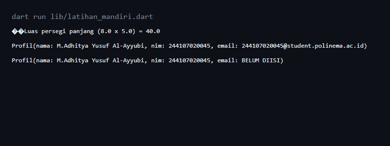
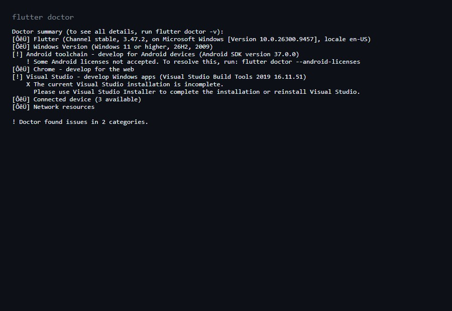
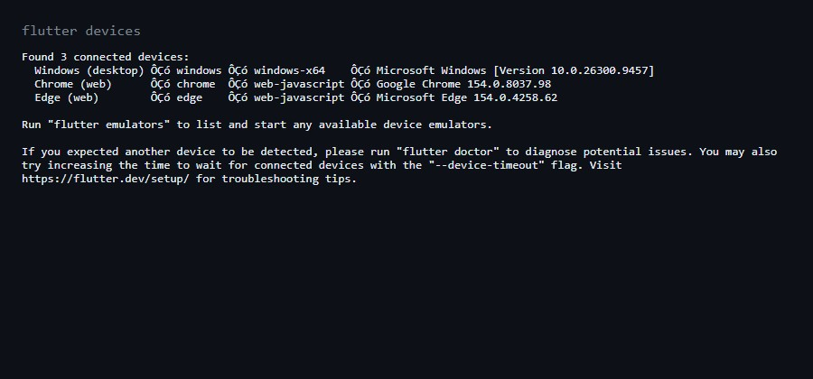
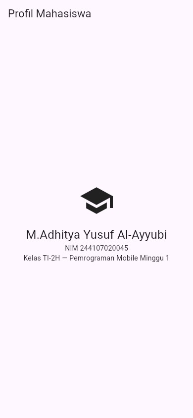

# 01 Week 1 Mobile Development Ecosystem & Flutter Refresh

Dokumentasi hasil pengerjaan Praktikum Pemrograman Mobile Minggu ke-1.
Dokumentasi ini telah berisi: screenshot, penjelasan, dan jawaban
pertanyaan dari praktikum.

Nama: M.Adhitya Yusuf Al-Ayyubi (NIM 244107020045, Kelas TI-2H)

## Latihan Mandiri

1. Buat fungsi `hitungLuasPersegiPanjang(double panjang, double lebar)`
   yang mengembalikan luas.
2. Buat kelas `Profil` dengan properti `nama`, `nim`, dan `email`
   (boleh null/empty).
3. Panggil keduanya dari `main()` dan tangani kondisi email kosong
   dengan aman (tanpa operator `!`, memakai `?.` dan nilai default).

Kode: [`my_first_app/lib/latihan_mandiri.dart`](my_first_app/lib/latihan_mandiri.dart)
(dijalankan dengan `dart run lib/latihan_mandiri.dart`).



## Praktikum

Aplikasi profil mahasiswa sesuai kode codelab, dijalankan di Chrome
viewport mobile 390x844. Kode: [`my_first_app/lib/main.dart`](my_first_app/lib/main.dart).


## Checklist Verifikasi

- `flutter doctor` tidak memiliki masalah yang menghambat target Android.
  (Catatan: 2 issue minor tidak terkait target web/Chrome — lihat Kendala.)

  

- `flutter devices` mendeteksi emulator/perangkat fisik.

  

- Aplikasi berjalan dan UI default telah diganti dengan profil sederhana.

  

- Dapat menjelaskan perbedaan hot reload dan hot restart.

Penjelasan singkat:

```text
- Hot reload: memuat ulang perubahan kode ke aplikasi yang sedang berjalan
  tanpa mengulang dari awal. Cepat untuk iterasi UI.
- Hot restart: memulai ulang aplikasi sepenuhnya dan memuat ulang seluruh
  kode. Dipakai bila perubahan butuh inisialisasi ulang.
```

- Repository berisi source code, README, screenshot, dan riwayat commit.

---

### Mini Assignment

Buat aplikasi Profil Mahasiswa berdasarkan praktikum. Tambahkan NIM dan satu
informasi tambahan (kelas TI-2H) menggunakan widget dasar.



---

### Kendala Setup

- `flutter doctor`: Android licenses belum diterima (`flutter doctor
  --android-licenses`) dan instalasi Visual Studio Build Tools tidak
  lengkap. Keduanya tidak menghambat target Chrome/web yang dipakai
  untuk praktikum ini; Chrome dan Edge terdeteksi di `flutter devices`.
- Kendala konfigurasi Android Studio agar Flutter dikenali sebagai target
  Android: diselesaikan dengan memastikan Android SDK, Command-line Tools,
  dan emulator terpasang via SDK/Device Manager.

## Hot Reload vs Hot Restart

### Hot Reload

Hot reload itu menerapkan perubahan pada kode saat aplikasi sedang berjalan
tanpa kehilangan state atau keadaan pada aplikasi terakhir Dengan mengubah
tampilan atau layout secara cepat karena perubahan terlihat dalam waktu
singkat tanpa restart atau refresh.

### Hot Restart

Hot restart itu menghentikan dan menjalankan ulang aplikasi dari awal
sehingga prosesnya lebih lambat dibanding hot reload tetapi berguna ketika
perubahan besar memengaruhi state aplikasi atau ketika kita ingin memastikan
aplikasi dimulai ulang sepenuhnya atau mungkin saat mengalami error yang fatal.

## Refleksi

### 1. Kapan native lebih tepat dipilih daripada cross-platform?

Native lebih tepat dipilih ketika membutuhkan aplikasi yang menuntut performa
tinggi atau optimasi yang sangat optimal pada perangkat tertentu karena
cross-platform kurang bisa menangani itu walaupun bisa menangani membuat
banyak aplikasi tanpa perlu ngoding di berbagai bahasa native.

### 2. Bagaimana perubahan state berhubungan dengan widget tree dan UI deklaratif?

Di Flutter state itu menentukan data yang sedang digunakan. Jadi ketika state
berubah widget tree akan dibangun ulang secara deklaratif dan tanpa mengubah
UI satu satu sehingga tampilan UI menyesuaikan dengan data terbaru tanpa perlu
mengubah tampilan secara langsung.

### 3. Mengapa commit kecil dengan pesan jelas bermanfaat bagi pekerjaan tim dan portfolio?

Karena commitan kecil bisa membantu tim untuk melihat perubahan secara spesifik
sehingga dapat meminimalkan konflik dan mempermudah koordinasinya. Klo untuk
portfolio commitan yang rapi dan jelas dapat menunjukkan proses belajar dan
kualitas yang kita kerjakan berasa lebih profesional.
