# 02 Week 2: Declarative UI and Responsive Design

Dokumentasi hasil pengerjaan Praktikum Pemrograman Mobile Minggu ke-2.
Dokumentasi ini telah berisi: screenshot, penjelasan, dan jawaban
pertanyaan dari praktikum.

## Identitas

| | |
| --- | --- |
| Nama | M.Adhitya Yusuf Al-Ayyubi |
| NIM | 244107020045 |
| Kelas | TI-2H |
| Program Studi | Teknik Informatika |
| Institusi | Politeknik Negeri Malang |

## Tujuan Praktikum

- Membangun dashboard akademik sederhana menggunakan Flutter.
- Menyusun tampilan menggunakan `Row`, `Column`, `Container`, dan `Expanded`.
- Membuat layout responsif untuk layar sempit dan layar lebar.
- Menampilkan kartu informasi akademik secara rapi dan mudah dipahami.
- Menerapkan pergantian light theme dan dark theme menggunakan `CupertinoSwitch`.
- Menambahkan `Semantics` agar informasi penting lebih mudah diakses screen reader.
- Membandingkan penggunaan `GridView` dengan `LayoutBuilder + Column`.
- Memahami cara mencegah overflow pada widget `Row` dan `Expanded`.
- Menguji tampilan aplikasi menggunakan ukuran layar yang berbeda.

## Praktikum: Layout Sederhana (Warm-up)

<table>
  <tr>
    <td align="center">
      <strong>Warm-up</strong><br><br>
      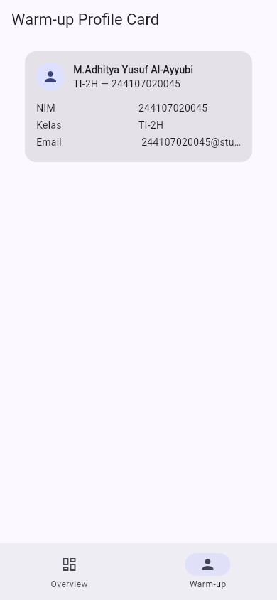
    </td>
  </tr>
</table>

### Eksperimen Warm-up

<table>
  <tr>
    <td align="center">
      <strong>Expanded</strong><br><br>
      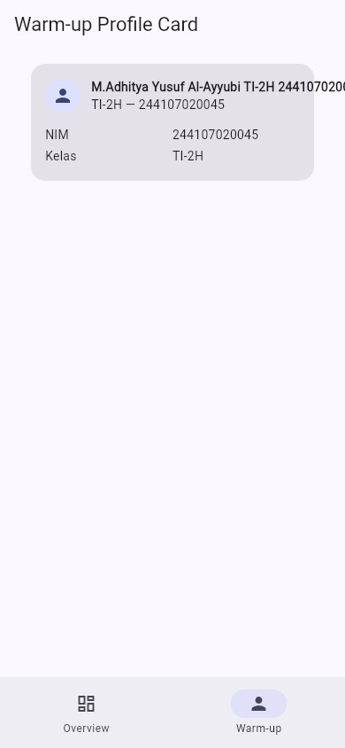
    </td>
    <td align="center">
      <strong>Main Axis</strong><br><br>
      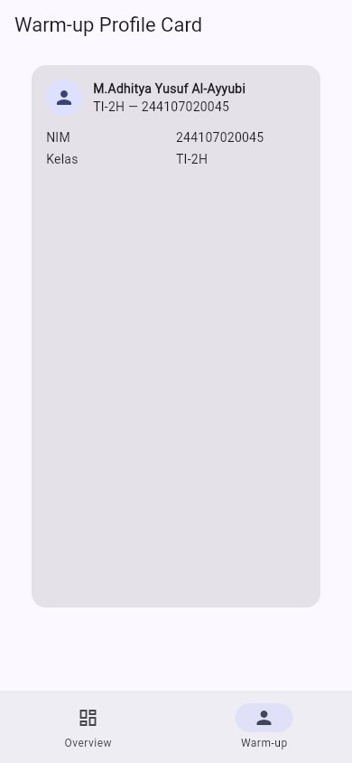
    </td>
    <td align="center">
      <strong>Email</strong><br><br>
      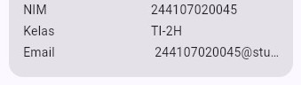
    </td>
  </tr>
</table>

1. **Expanded** — `Expanded` pada kolom nama dihapus, teks panjang
   menabrak batas kartu dan terpotong (overflow). Setelah `Expanded`
   dikembalikan, `Row` bisa membagi ruang dengan benar.
2. **Main Axis** — `mainAxisSize: MainAxisSize.min` diganti `max`,
   kartu meregang setinggi ruang yang tersedia dan terlihat kosong
   di bawah. Dipakai kembali `min` agar kartu hanya setinggi isi.
3. **Email** — baris Email ditambahkan dengan pola `Row` + `Expanded`
   yang sama. Email panjang dibungkus `Flexible` +
   `TextOverflow.ellipsis` sehingga terpotong rapi (`...`), bukan
   overflow.

## Praktikum: Dashboard Responsif

### Eksperimen Layout

<table>
  <tr>
    <td align="center">
      <strong>Profil+Cupertino</strong><br><br>
      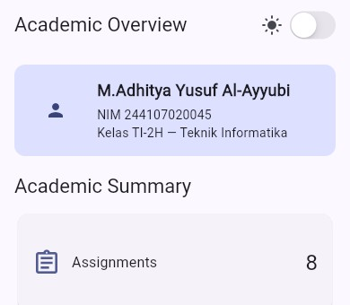
    </td>
    <td align="center">
      <strong>Layar Lebar</strong><br><br>
      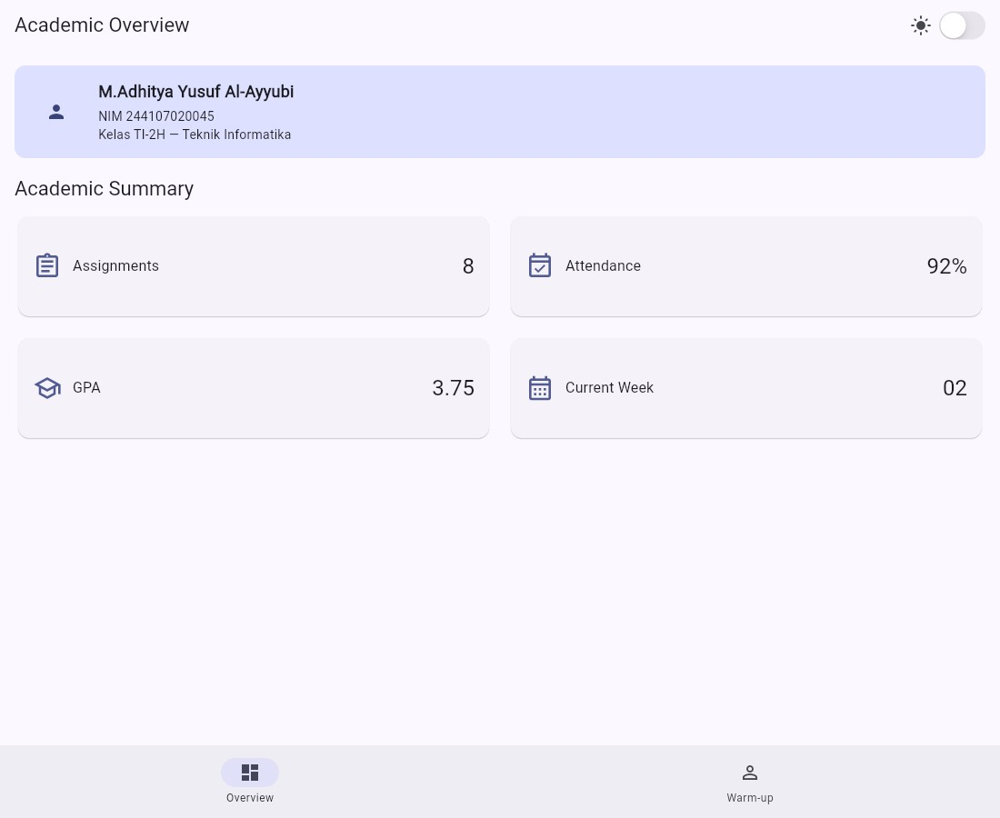
    </td>
  </tr>
</table>

1. **Breakpoint** — konstanta `kWideBreakpoint = 700` di `lib/main.dart`.
   `< 700` tampil satu kolom, `>= 700` tampil dua kolom.
2. **`themeMode`** — dikontrol state `isDark` lewat `CupertinoSwitch`
   di `AppBar` (komponen Cupertino di dalam `MaterialApp`). Mode gelap
   tetap terbaca dengan kontras yang baik:

   <table>
     <tr>
       <td align="center">
         <strong>Dark Mode</strong><br><br>
         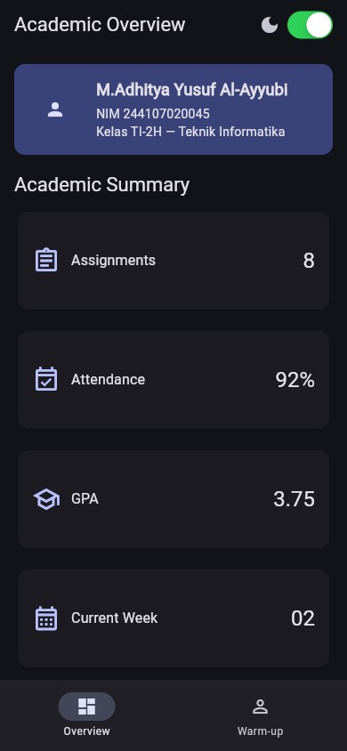
       </td>
     </tr>
   </table>

3. **Ukuran layar** — diuji via widget test (`400x900` vs `1200x900`)
   dan screenshot browser (390px vs 1100px).
4. **`Semantics`** — label aksesibilitas pada header profil, tiap kartu
   (`Assignments: 8`, dst.), dan switch tema
   (`Mode gelap/terang aktif`, `toggled`).

## Tugas Utama: Academic Overview

Pada tugas utama, dashboard dikembangkan menjadi halaman **Academic Overview**
yang menampilkan informasi akademik mahasiswa secara sederhana dan responsif.

### Fitur yang Diimplementasikan

- Menampilkan header profil mahasiswa.
- Menampilkan nama mahasiswa, NIM, dan kelas.
- Menampilkan empat kartu informasi akademik:
  - Assignments
  - Attendance
  - GPA
  - Current Week
- Menggunakan widget `Row` untuk menyusun elemen secara horizontal.
- Menggunakan widget `Column` untuk menyusun informasi secara vertikal.
- Menggunakan `Expanded` agar elemen dapat menyesuaikan ruang yang tersedia.
- Menggunakan `Container` untuk membentuk area header profil.
- Menggunakan `LayoutBuilder` untuk menyesuaikan tampilan berdasarkan ukuran layar.
- Menampilkan satu kolom pada layar sempit.
- Menampilkan dua kolom pada layar lebar.
- Menyediakan light theme dan dark theme.
- Menambahkan toggle tema menggunakan `CupertinoSwitch`.
- Menambahkan label aksesibilitas menggunakan `Semantics`.

Hasil Implementasi

<table>
  <tr>
    <td align="center">
      <strong>Academic Overview</strong><br><br>
      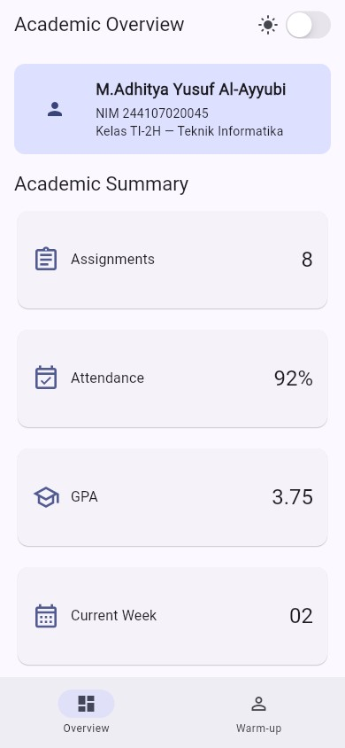
      <br><br>
      Satu kolom
    </td>
    <td align="center">
      <strong>Academic Layar Lebar</strong><br><br>
      
      <br><br>
      Dua kolom
    </td>
  </tr>
</table>

Screenshot diambil dari aplikasi yang dijalankan di **Chrome (web)
dalam viewport mobile 390x844** memakai skrip
`screenshots/take_screenshots.py` (Playwright + Chrome headless,
hasil `flutter build web`).

### Hasil

<table>
  <tr>
    <td align="center">
      <strong>Hasil Test</strong><br><br>
      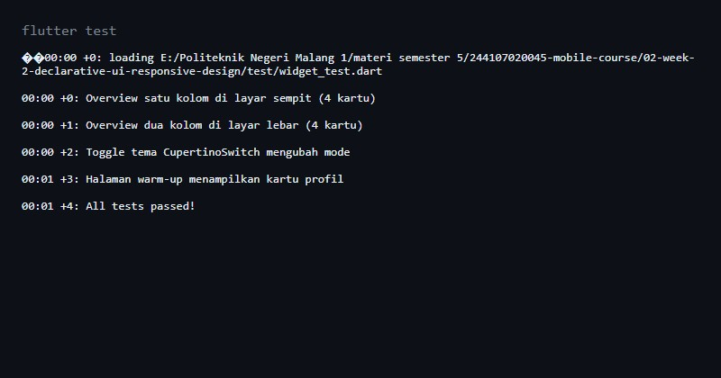
      <br><br>
      Semua Tes Berhasil
    </td>
  </tr>
</table>

<table>
  <tr>
    <td align="center">
      <strong>Hasil Analyze</strong><br><br>
      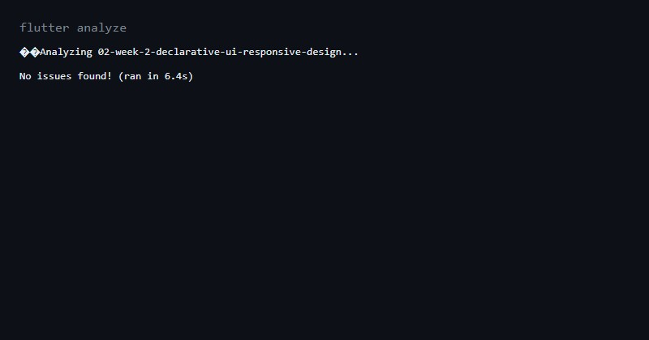
      <br><br>
      No issues found
    </td>
  </tr>
</table>

## AI Prompt Challenge (terdokumentasi)

Dilakukan **setelah** implementasi mandiri selesai:

<table>
  <tr>
    <td align="center">
      <strong>Prompt Desain + Keputusan</strong><br><br>
      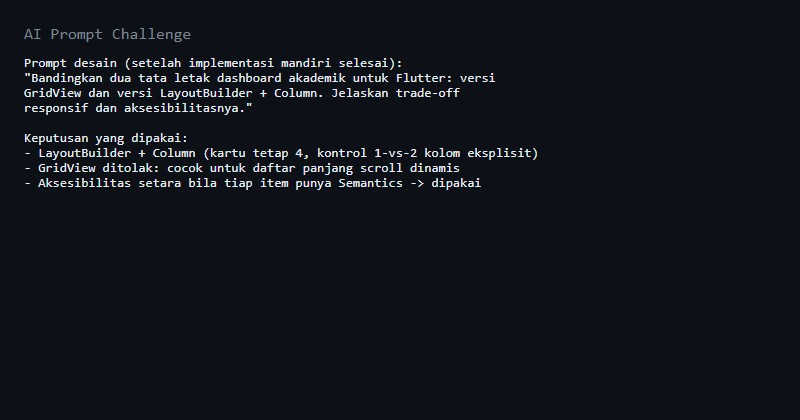
    </td>
  </tr>
</table>

<table>
  <tr>
    <td align="center">
      <strong>Verifikasi Rekomendasi AI</strong><br><br>
      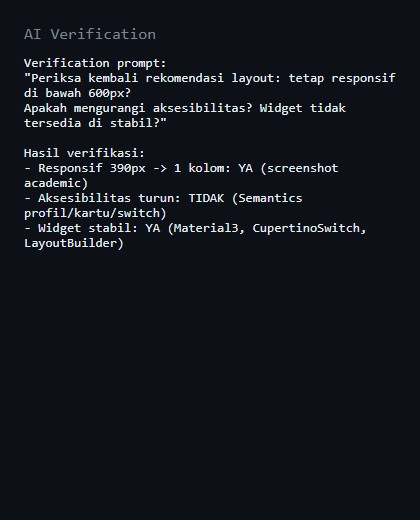
    </td>
  </tr>
</table>

1. **Prompt desain** — "Bandingkan `GridView` vs `LayoutBuilder` +
   `Column` untuk dashboard akademik Flutter (trade-off responsif dan
   aksesibilitas)." Keputusan: `LayoutBuilder` + `Column` karena jumlah
   kartu tetap (4) dan butuh kontrol eksplisit 1-vs-2 kolom.
2. **Prompt penguatan konsep** — "Kapan `Expanded` menyebabkan overflow
   di `Row`, contoh gagal + perbaikan." Diverifikasi langsung lewat
   eksperimen di atas.
3. **Verification prompt** — responsif di bawah 600px (terbukti 390px,
   1 kolom), aksesibilitas tidak turun, semua widget dari Flutter stabil.

## Refactoring Challenge

1. Kartu diekstrak jadi widget reusable `AcademicCard(title, value, icon)`
   dan baris info jadi `InfoRow(label, value)` — tanpa duplikasi.
2. Warna/ukuran mengikuti `Theme.of(context)` agar otomatis ikut
   light/dark theme.
3. Breakpoint satu konstanta `kWideBreakpoint = 700`.
4. `flutter analyze` bersih, tanpa error/warning baru.

## Cara Menjalankan

```bash
cd 02-week-2-declarative-ui-responsive-design
flutter pub get
flutter analyze
flutter test
flutter run -d chrome   # buka tab Overview & Warm-up
```

Screenshot dapat dibuat ulang dengan:

```bash
flutter build web --release
python screenshots/take_screenshots.py
```

## Refleksi

### 1. Perbedaan Imperative dan Declarative

Menurut saya, imperative adalah cara membuat UI dengan memberikan perintah
satu per satu, misalnya menentukan kapan tampilan harus dibuat atau diubah.

Sedangkan declarative lebih berfokus pada hasil tampilan berdasarkan kondisi
tertentu. Di Flutter, ketika nilai state berubah maka tampilan akan
menyesuaikan secara otomatis. Contohnya, saat nilai `isDark` berubah, tema
aplikasi ikut berubah tanpa saya menyentuh tiap kartu satu per satu.

### 2. Penggunaan Expanded

`Expanded` membantu ketika digunakan di dalam `Row` atau `Column` untuk
membagi ruang yang tersedia. Pada dashboard, `Expanded` digunakan agar judul
kartu tidak tembus ke luar layar.

Namun, `Expanded` bisa menyebabkan error jika digunakan pada ruang yang tidak
memiliki batas ukuran yang jelas. Contohnya adalah `Row` di dalam scroll
horizontal. Overflow juga bisa terjadi jika ada widget lain yang memiliki
ukuran tetap terlalu besar.

### 3. Pengaruh Breakpoint dan Theme

Breakpoint menentukan perubahan susunan layout berdasarkan ukuran layar. Pada
aplikasi ini, layar sempit menggunakan satu kolom, sedangkan layar lebar
menggunakan dua kolom. Hal ini membuat kartu tetap mudah dibaca dan tidak
terlalu sempit.

Theme juga memengaruhi kenyamanan pengguna. Light theme lebih cocok digunakan
pada kondisi terang, sedangkan dark theme dapat digunakan pada kondisi yang
lebih gelap. Warna teks dan latar belakang harus tetap memiliki kontras agar
tulisan bisa dibaca pada kedua tema.

### 4. Verifikasi Rekomendasi AI

Setelah tugas utama selesai, saya membandingkan layout `GridView` dengan
`LayoutBuilder + Column`. Saya mencoba keduanya pada layar sempit dan layar
lebar untuk melihat perubahan jumlah kolom.

Saya juga memeriksa apakah penggunaan `Expanded` menyebabkan overflow, mencoba
toggle light theme dan dark theme, serta memastikan label `Semantics` terdapat
pada switch tema dan kartu informasi. Selain itu, aplikasi dijalankan pada
beberapa ukuran layar untuk memastikan tampilannya tetap responsif.

## Checklist Verifikasi

- [x] `flutter analyze` tidak menghasilkan error.
- [x] `flutter test` berhasil dijalankan dan semua widget test responsif lulus.
- [x] Aplikasi berhasil dijalankan pada ukuran layar sempit.
- [x] Aplikasi berhasil dijalankan pada ukuran layar lebar.
- [x] Tampilan berubah menjadi satu kolom pada layar sempit.
- [x] Tampilan berubah menjadi dua kolom pada layar lebar.
- [x] Dark mode memiliki kontras warna yang baik.
- [x] Teks tetap terbaca pada light theme dan dark theme.
- [x] Toggle tema dapat digunakan untuk berpindah antara light theme dan dark theme.
- [x] Label aksesibilitas pada informasi dan tombol penting dapat dijelaskan.
- [x] Struktur widget dapat dijelaskan saat code review.
- [x] Screenshot layar sempit sudah tersimpan di folder `screenshots/`.
- [x] Screenshot layar lebar sudah tersimpan di folder `screenshots/`.
- [x] Folder `test/` sudah tersimpan pada folder tugas Week 2.
- [x] File `README.md` sudah tersimpan pada folder tugas Week 2.
- [x] Semua file tugas Week 2 sudah diperiksa sebelum dikumpulkan.
